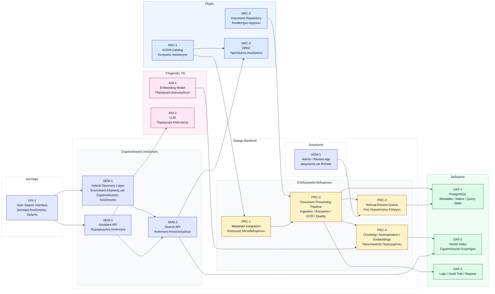

# High-Level System Architecture

## Σκοπός

Το παρόν κείμενο αποτυπώνει τη high-level εικόνα του τελικού συστήματος, δηλαδή τον τρόπο με τον οποίο οργανώνεται η λύση όταν περάσει από το `PoC` σε πιο ώριμη και επεκτάσιμη μορφή.

Συγκεκριμένα, δείχνει:

- ποια είναι τα βασικά υποσυστήματα
- πού γίνεται η επεξεργασία των τεκμηρίων
- πώς συνδέονται τα μεταδεδομένα, η επεξεργασία των τεκμηρίων, η αναζήτηση και η παραγωγή απάντησης

## Βασική αρχή

Η αρχιτεκτονική στηρίζεται σε μία κρίσιμη αρχή:

```text
KOHA = επίσημη βιβλιοθηκονομική βάση
AI layer = συμπληρωματικό επίπεδο αναζήτησης και απάντησης
```

Το `KOHA` παραμένει ο επίσημος κατάλογος της βιβλιοθήκης. Το νέο σύστημα δεν αλλάζει αυτόν τον ρόλο, αλλά προσθέτει ένα επιπλέον επίπεδο αναζήτησης και τεκμηριωμένης απάντησης.

Σε τεχνικό επίπεδο, η λύση αντιμετωπίζεται ως ένα ενιαίο σύστημα με διακριτά υποσυστήματα. Μέσα σε αυτό, το ίδιο backend καλύπτει τόσο τις online λειτουργίες αναζήτησης και απάντησης όσο και τις batch / background ροές προετοιμασίας του περιεχομένου.

## Διάγραμμα



## Τι δείχνει το διάγραμμα

Το διάγραμμα αποτυπώνει την ακόλουθη λογική:

1. Οι βασικές πηγές είναι το `KOHA`, το αποθετήριο των αρχείων και το υφιστάμενο `OPAC`.
2. Από εκεί ξεκινά η ροή επεξεργασίας των τεκμηρίων: εισαγωγή, extraction, `OCR`, quality checks και, όπου χρειάζεται, review.
3. Το κατάλληλο περιεχόμενο αποθηκεύεται και ευρετηριάζεται τόσο σε κλασικό όσο και σε vector επίπεδο.
4. Πάνω σε αυτή τη βάση λειτουργεί το ίδιο κεντρικό σύστημα, όπου το `Django` backend καλύπτει τόσο το υποσύστημα σημασιολογικής αναζήτησης όσο και τις batch / background ροές επεξεργασίας.
5. Η ροή καταλήγει στον χρήστη μέσω ενιαίου περιβάλλοντος αναζήτησης.

## Υποσυστήματα

### 1. `SRC-*` Υποσύστημα πηγών

Το υποσύστημα πηγών περιλαμβάνει:

- το `KOHA` ως βασική πηγή καταλογογράφησης και μεταδεδομένων
- το αποθετήριο των αρχείων
- το υφιστάμενο `OPAC`

Σε αυτό το επίπεδο βρίσκονται οι αρχικές είσοδοι του συστήματος. Το `KOHA` παραμένει η επίσημη βιβλιοθηκονομική βάση, το αποθετήριο παρέχει το πρωτογενές υλικό προς επεξεργασία και το `OPAC` καλύπτει το κλασικό επίπεδο αναζήτησης.

### 2. `UIX-*` Υποσύστημα διεπαφής

Το υποσύστημα διεπαφής είναι το user-facing σημείο του συστήματος. Μέσω αυτού ο χρήστης υποβάλλει αναζητήσεις, λαμβάνει αποτελέσματα και αλληλεπιδρά με τον assistant.

Ο ρόλος του είναι καθαρά λειτουργικός: δεν αναλαμβάνει retrieval, επεξεργασία ή παραγωγή απάντησης, αλλά δρομολογεί το αίτημα προς το backend.

### 3. `SEM-*` Υποσύστημα σημασιολογικής αναζήτησης

Το υποσύστημα σημασιολογικής αναζήτησης υλοποιείται μέσα στο `Django` backend και περιλαμβάνει:

- το `SEM-1` για τον συνδυασμό κλασικής και σημασιολογικής αναζήτησης
- το `SEM-2` για την ανάκτηση αποτελεσμάτων
- το `SEM-3` για την τεκμηριωμένη απάντηση

Εδώ συγκεντρώνεται η online λογική του συστήματος. Το υποσύστημα αυτό δέχεται το αίτημα από τη διεπαφή, αξιοποιεί το ευρετήριο και, όπου χρειάζεται, ενεργοποιεί το επίπεδο απάντησης πάνω σε ανακτημένο υλικό.

Σε ώριμη μορφή, το υποσύστημα αυτό λειτουργεί με λογική `hybrid retrieval`, δηλαδή:

- λαμβάνει το ερώτημα του χρήστη
- αξιοποιεί αφενός το κλασικό επίπεδο metadata / catalog search
- αξιοποιεί αφετέρου τη σημασιολογική ανάκτηση πάνω στα indexed chunks
- ενοποιεί τα δύο streams αποτελεσμάτων
- και επιστρέφει είτε ranked results είτε τεκμηριωμένη απάντηση με σαφείς πηγές

Η κρίσιμη αρχή είναι ότι το semantic layer δεν καταργεί το catalog logic. Το συμπληρώνει και το εμπλουτίζει.

### 4. `PRC-*` Υποσύστημα επεξεργασίας δεδομένων

Το υποσύστημα επεξεργασίας δεδομένων καλύπτει τις batch / background ροές:

- εισαγωγή μεταδεδομένων
- επεξεργασία τεκμηρίων
- extraction και `OCR`
- βασικούς ποιοτικούς ελέγχους
- chunking και προετοιμασία περιεχομένου για embeddings

Εδώ παράγεται το ενδιάμεσο υλικό πάνω στο οποίο θα βασιστεί η σημασιολογική ευρετηρίαση. Πρόκειται για το υποσύστημα που μετατρέπει το πρωτογενές περιεχόμενο σε αξιοποιήσιμη μορφή για αναζήτηση και απάντηση.

### 5. `ADM-*` Υποσύστημα διαχείρισης

Το υποσύστημα διαχείρισης υποστηρίζει:

- review οριακών ή προβληματικών περιπτώσεων
- παρακολούθηση της ροής επεξεργασίας
- διορθωτικές παρεμβάσεις όπου χρειάζονται

Ο ρόλος του είναι να ενσωματώνει το human-in-the-loop στοιχείο στη συνολική αρχιτεκτονική, χωρίς να διακόπτει την αυτοματοποιημένη ροή όπου αυτή λειτουργεί επαρκώς.

### 6. `DAT-*` Υποσύστημα δεδομένων

Το υποσύστημα δεδομένων περιλαμβάνει:

- αποθήκευση μεταδεδομένων και operational state
- vector index για σημασιολογική ανάκτηση
- logs, audit trail και αναφορές

Δεν λειτουργεί μόνο ως τεχνική υποδομή αποθήκευσης. Παρέχει και τη βάση ιχνηλασιμότητας, παρακολούθησης και ελέγχου της επεξεργασίας.

### 7. `AIN-*` Υποσύστημα υπηρεσιών τεχνητής νοημοσύνης

Το υποσύστημα υπηρεσιών τεχνητής νοημοσύνης περιλαμβάνει:

- το embedding model
- το `LLM`

Τα μοντέλα λειτουργούν ως υποστηρικτικές υπηρεσίες του συστήματος. Το πρώτο χρησιμοποιείται για την παραγωγή διανυσματικών αναπαραστάσεων και το δεύτερο για την παραγωγή απάντησης, πάντα πάνω σε συγκεκριμένο ανακτημένο και τεκμηριωμένο πλαίσιο.

## Κρίσιμα σημεία της αρχιτεκτονικής

Τα κρισιμότερα σημεία της αρχιτεκτονικής είναι τα εξής:

- Το `KOHA` διατηρεί τον βασικό του ρόλο ως σύστημα καταλόγου της βιβλιοθήκης.
- Το `AI layer` είναι συμπληρωματικό και όχι ανταγωνιστικό προς το υπάρχον search.
- Υπάρχει `quality gating` πριν από τη σημασιολογική ευρετηρίαση.
- Υπάρχει `manual review` για δύσκολες ή οριακές περιπτώσεις.
- Η αναζήτηση είναι `hybrid`, δηλαδή συνδυάζει κλασικό search και semantic retrieval.
- Ο assistant δεν απαντά χωρίς retrieved context και πηγές.

Αυτό σημαίνει επίσης ότι το user-facing αποτέλεσμα του συστήματος πρέπει να μπορεί να διακρίνει καθαρά:

- ποια είναι τα βασικά returned results
- ποια αποσπάσματα υποστηρίζουν τη σημασιολογική ανάκτηση
- και ποια answer summary, όπου υπάρχει, παράγεται πάνω σε αυτά

## Γιατί αυτή η αρχιτεκτονική είναι κατάλληλη

Η συγκεκριμένη αρχιτεκτονική είναι κατάλληλη για το έργο γιατί:

- επιτρέπει σταδιακή ωρίμανση
- δεν απαιτεί τέλεια επεξεργασία όλου του corpus από την πρώτη μέρα
- προστατεύει το retrieval layer από χαμηλής ποιότητας extracted text
- επιτρέπει automation σε μεγάλη κλίμακα
- κρατά χώρο για human-in-the-loop όπου πραγματικά χρειάζεται
- επιτρέπει μελλοντική ενσωμάτωση πιο κοντά στο `KOHA` χωρίς να αλλάξει ο βασικός ρόλος του

## Σχέση με το PoC

Το `PoC` λειτουργεί ως μικρογραφία αυτής της αρχιτεκτονικής.

Στην πιλοτική φάση:

- χρησιμοποιούμε export από το `KOHA`
- επεξεργαζόμαστε περιορισμένο σύνολο τεκμηρίων
- δοκιμάζουμε extraction, quality gating, retrieval και answer flow
- αξιολογούμε αν η λογική του τελικού συστήματος στέκεται στην πράξη

Η τελική αρχιτεκτονική, επομένως, δεν είναι ανεξάρτητη από το `PoC`. Αποτελεί την εξέλιξη της ίδιας λογικής σε μεγαλύτερη κλίμακα και με πιο ώριμες διασυνδέσεις.

## Συμπέρασμα

Η προτεινόμενη αρχιτεκτονική αντιμετωπίζει το έργο ως ενιαίο σύστημα αναζήτησης και τεκμηριωμένης υποστήριξης, και όχι ως ένα απλό chatbot.

Το `KOHA` παραμένει η βιβλιοθηκονομική βάση του συστήματος. Πάνω σε αυτήν προστίθεται ένα επίπεδο επεξεργασίας, retrieval και τεκμηριωμένης απάντησης, ικανό να βελτιώσει ουσιαστικά την αναζήτηση χωρίς να αλλοιώσει τον βασικό ρόλο του καταλόγου.
