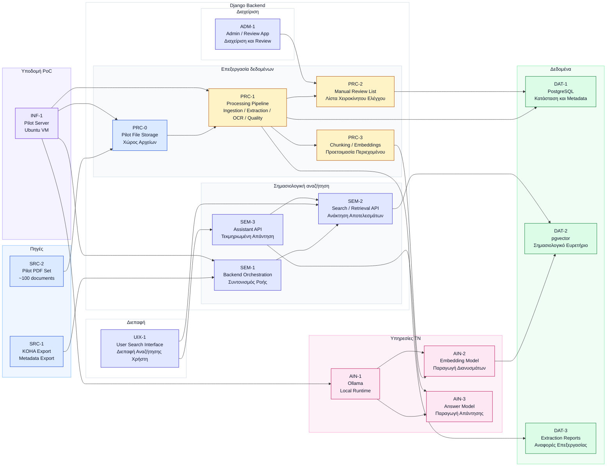

# PoC Architecture

## Σκοπός

Το παρόν κείμενο περιγράφει την αρχιτεκτονική της πρώτης λειτουργικής μορφής του `PoC`.

Σε αντίθεση με το high-level μοντέλο του τελικού συστήματος, εδώ μας ενδιαφέρει το πρακτικό ερώτημα: τι στήνεται άμεσα ώστε να μπορεί να εκτελεστεί η πρώτη πλήρης ροή αναζήτησης σε πραγματικά δεδομένα.

Συγκεκριμένα, δείχνει:

- ποιες είναι οι βασικές είσοδοι του πιλοτικού
- ποια στοιχεία ανήκουν στο ίδιο πιλοτικό σύστημα
- πού γίνεται η εξαγωγή κειμένου, το `OCR`, η ευρετηρίαση και η αναζήτηση
- πού εντάσσεται το `Ollama`
- ποιο είναι το ελάχιστο λειτουργικό σύνολο για να αποδώσει το `PoC`

## Διάγραμμα



## Τι δείχνει το διάγραμμα

Το διάγραμμα αποτυπώνει τη βασική ροή του `PoC`:

1. Το πιλοτικό ξεκινά από δύο εισόδους: export από το `KOHA` και ένα περιορισμένο σύνολο περίπου `100` αρχείων `PDF`.
2. Τα αρχεία τοποθετούνται στο pilot storage και τροφοδοτούν την αλυσίδα επεξεργασίας.
3. Η επεξεργασία συγκεντρώνεται σε ενιαίο pipeline: εισαγωγή, extraction, `OCR` όπου χρειάζεται και ποιοτικός έλεγχος.
4. Οι αμφίβολες περιπτώσεις απομονώνονται σε ξεχωριστή λίστα review.
5. Το κατάλληλο περιεχόμενο μετατρέπεται σε chunks και embeddings και αποθηκεύεται στο `pgvector`.
6. Ο χρήστης αναζητά μέσω του υποσυστήματος διεπαφής του `PoC`, ενώ μέσα στο ίδιο `Django` σύστημα το υποσύστημα σημασιολογικής αναζήτησης εξυπηρετεί τόσο την ανάκτηση αποτελεσμάτων όσο και την τεκμηριωμένη απάντηση πάνω σε ανακτημένο υλικό.

## Τι περιλαμβάνει το PoC

Το `PoC` περιλαμβάνει μόνο τα απολύτως απαραίτητα για να λειτουργήσει η πρώτη πλήρης ροή:

- export metadata από το `KOHA`
- πιλοτικό σύνολο περίπου `100` αρχείων `PDF`
- αποθηκευτικό χώρο για τα αρχεία του pilot
- backend για ingestion, retrieval και answer logic
- βασικό `API` αναζήτησης
- pipeline για extraction, `OCR` και quality gating
- `PostgreSQL` και `pgvector`
- απλό frontend αναζήτησης
- `Ollama` για embeddings και answer generation

Αυτό το σύνολο αρκεί για να κριθεί αν η λογική του έργου στέκεται στην πράξη, χωρίς να χρειαστεί από την πρώτη φάση πλήρες παραγωγικό περιβάλλον.

## Κύριες τεχνικές φάσεις του PoC

Σε λειτουργικό επίπεδο, το `PoC` μπορεί να ιδωθεί ως μια αλληλουχία από βασικές τεχνικές φάσεις.

### 1. Προετοιμασία δεδομένων

Στη φάση αυτή συγκεντρώνονται:

- το export μεταδεδομένων από το `KOHA`
- το πιλοτικό σύνολο περίπου `100` `PDF`
- η βασική αντιστοίχιση ανάμεσα σε αρχεία και metadata
- ένα σταθερό αναγνωριστικό ή mapping ανάμεσα σε `KOHA record`, filename και εσωτερικό `document_id`
- μια πρώτη εικόνα πληρότητας του dataset, δηλαδή ποια αρχεία έχουν valid metadata match και ποια όχι

Πρακτικά, η φάση αυτή δεν ολοκληρώνεται μόνο με την παραλαβή των `PDF`. Πρέπει να έχει αποσαφηνιστεί επίσης:

- ποια είναι η ακριβής πηγή των αρχείων
- ποια έκδοση του `KOHA` export χρησιμοποιείται
- πώς συνδέεται κάθε `PDF` με το σωστό bibliographic record
- αν υπάρχουν unmatched ή προβληματικά αρχεία που πρέπει να αντιμετωπιστούν πριν από το ingestion

### 2. Στήσιμο του πιλοτικού περιβάλλοντος

Στη φάση αυτή προετοιμάζονται:

- ο pilot server
- το `Django` backend
- η `PostgreSQL`
- το `pgvector`
- το `Ollama`
- τα βασικά storage paths και οι προσβάσεις

Οι συγκεκριμένες επιλογές υποδομής, οι υπηρεσίες, τα ports, τα hostnames και τα storage paths αναλύονται στο [04_poc_setup_and_requirements.md](/Users/stelios/Documents/Hartis/ΕΑΓΜΕ/eagme-ai-assistant/docs/04_poc_setup_and_requirements.md).

### 3. Ingestion και καταχώριση τεκμηρίων

Στη φάση αυτή:

- φορτώνονται τα metadata
- καταχωρίζονται τα `PDF`
- δημιουργείται η αρχική εσωτερική εικόνα για documents, pages και processing status
- συνδέεται κάθε αρχείο με το αντίστοιχο bibliographic record όπου αυτό είναι δυνατό
- καταγράφονται βασικά στοιχεία όπως `document_id`, filename, path, checksum, page count και ingest status
- ξεχωρίζουν τα τεκμήρια που είναι έτοιμα για extraction από όσα έχουν ελλιπές ή αμφίβολο metadata match

Το αποτέλεσμα της φάσης δεν είναι απλώς ότι "μπήκαν αρχεία στο σύστημα". Το αποτέλεσμα είναι ότι το `PoC` αποκτά μια πρώτη αξιόπιστη registry εγγράφων, πάνω στην οποία μπορούν να εκτελεστούν με ελεγχόμενο τρόπο οι επόμενες batch ροές.

Η πιο συγκεκριμένη λογική commands, status fields και μοντέλων για το ingestion αποτυπώνεται στα:

- [04_poc_setup_and_requirements.md](/Users/stelios/Documents/Hartis/ΕΑΓΜΕ/eagme-ai-assistant/docs/04_poc_setup_and_requirements.md)
- [poc_implementation_notes/django_commands_mapping.md](/Users/stelios/Documents/Hartis/ΕΑΓΜΕ/eagme-ai-assistant/poc_implementation_notes/django_commands_mapping.md)
- [poc_implementation_notes/django_models_outline.md](/Users/stelios/Documents/Hartis/ΕΑΓΜΕ/eagme-ai-assistant/poc_implementation_notes/django_models_outline.md)

### 4. Extraction και quality gating

Στη φάση αυτή εκτελείται:

- native text extraction
- `OCR` fallback όπου χρειάζεται
- normalization κειμένου
- αξιολόγηση ποιότητας ανά σελίδα
- απόφαση για το αν το περιεχόμενο οδηγείται σε `index_content`, `metadata_only`, `manual_review` ή `skip`

Η αναλυτική λειτουργική λογική του extraction pipeline, του `OCR` fallback και των quality statuses δίνεται στο [06_extraction_and_quality_approach.md](/Users/stelios/Documents/Hartis/ΕΑΓΜΕ/eagme-ai-assistant/docs/06_extraction_and_quality_approach.md).

### 5. Chunking και δημιουργία embeddings

Στη φάση αυτή:

- επιλέγεται μόνο το κατάλληλο περιεχόμενο
- δημιουργούνται chunks
- παράγονται embeddings
- τα vectors αποθηκεύονται στο `pgvector`

Η αναλυτική περιγραφή του local AI runtime, των models και των κλήσεων προς `Ollama` δίνεται στο [05_ollama_and_ai_runtime.md](/Users/stelios/Documents/Hartis/ΕΑΓΜΕ/eagme-ai-assistant/docs/05_ollama_and_ai_runtime.md).

### 6. Αναζήτηση και τεκμηριωμένη απάντηση

Στη φάση αυτή:

- ο χρήστης υποβάλλει ερώτημα
- το backend αποφασίζει αν θα εκτελέσει μόνο retrieval ή retrieval μαζί με answer generation
- το query μετατρέπεται σε embedding με το ίδιο embedding model που χρησιμοποιήθηκε για το indexed περιεχόμενο
- εκτελείται vector similarity search στο `pgvector`
- όπου χρειάζεται, το semantic αποτέλεσμα συνδυάζεται με metadata / catalog πληροφορία
- επιλέγονται τα πιο σχετικά chunks μαζί με τις αναφορές τους σε τεκμήριο και σελίδα
- επιστρέφεται είτε λίστα αποτελεσμάτων αναζήτησης είτε τεκμηριωμένη απάντηση πάνω στο ήδη ανακτημένο context

Σε πρακτικό επίπεδο, η βασική ροή είναι η εξής:

```text
user query
  ↓
query embedding
  ↓
vector retrieval
  ↓
selection of top chunks
  ↓
source packaging
  ↓
search results or assistant answer
```

Στο `PoC`, η λογική `hybrid retrieval` πρέπει να διαβαστεί με πρακτικό και όχι υπερβολικά βαρύ τρόπο. Δεν σημαίνει απαραίτητα πολύπλοκο multi-stage ranking από την πρώτη μέρα. Σημαίνει ότι το backend πρέπει να έχει τη δυνατότητα να συνδυάζει:

- catalog ή metadata matches
- semantic matches από το vector index

και να επιστρέφει ένα ενιαίο, κατανοητό αποτέλεσμα προς τη διεπαφή.

Η ελάχιστη σωστή λογική είναι:

```text
query
  ↓
metadata / catalog lookup
  +
semantic retrieval
  ↓
merge and prioritization
  ↓
returned results
```

Στην πρώτη φάση, αυτό μπορεί να υλοποιηθεί με σχετικά απλή πολιτική συγχώνευσης, αρκεί να είναι σαφές:

- ποια results προέρχονται κυρίως από metadata match
- ποια results προέρχονται από semantic similarity
- ποια chunks χρησιμοποιούνται αργότερα ως context για answer generation

### Τι πρέπει να επιστρέφεται στη διεπαφή

Ανεξάρτητα από το αν η διεπαφή είναι απλή ή πιο ώριμη, το backend πρέπει να μπορεί να επιστρέφει τουλάχιστον τα εξής:

- λίστα σχετικών τεκμηρίων
- βασικά metadata του κάθε τεκμηρίου
- αποσπάσματα ή chunks που αιτιολογούν γιατί το αποτέλεσμα θεωρήθηκε σχετικό
- αναφορά σε έγγραφο και σελίδα
- προαιρετικά σύντομη τεκμηριωμένη answer summary

Με άλλα λόγια, το `PoC` δεν πρέπει να επιστρέφει μόνο "έναν τίτλο" ή μόνο "μία απάντηση". Πρέπει να επιστρέφει και το ελάχιστο explanatory context που επιτρέπει στον χρήστη να ελέγξει την πηγή.

Η διάκριση ανάμεσα στα δύο τελικά outputs είναι σημαντική:

- στο `search` mode το σύστημα επιστρέφει κυρίως σχετικά τεκμήρια ή αποσπάσματα
- στο `assistant` mode το σύστημα χρησιμοποιεί τα ήδη ανακτημένα αποσπάσματα για να συνθέσει σύντομη απάντηση με αναφορά σε πηγές

Πρακτικά, αυτό σημαίνει ότι η διεπαφή πρέπει να είναι σε θέση να λάβει δύο συγγενείς αλλά διακριτές μορφές response:

- `search response`
  - ordered results
  - source snippets
  - document/page references
- `assistant response`
  - answer summary
  - supporting snippets
  - document/page references

Ακόμη και αν στην πρώτη φάση αυτά τα δύο modes μοιράζονται κοινό endpoint ή κοινή σελίδα, η λειτουργική διάκριση πρέπει να είναι καθαρή στο backend.

Η πιο συγκεκριμένη αποτύπωση του ελάχιστου response contract δίνεται στο [poc_implementation_notes/api_response_contract.md](/Users/stelios/Documents/Hartis/ΕΑΓΜΕ/eagme-ai-assistant/poc_implementation_notes/api_response_contract.md).

Άρα το answer layer δεν υποκαθιστά την αναζήτηση. Χτίζει πάνω σε αυτήν.

Η πιο αναλυτική περιγραφή του local answer runtime και της κλήσης προς `Ollama` δίνεται στο [05_ollama_and_ai_runtime.md](/Users/stelios/Documents/Hartis/ΕΑΓΜΕ/eagme-ai-assistant/docs/05_ollama_and_ai_runtime.md).

### 7. Αξιολόγηση και βαθμονόμηση

Στη φάση αυτή εξετάζεται:

- αν το extraction pipeline είναι επαρκώς αξιόπιστο
- αν το retrieval δίνει χρήσιμα αποτελέσματα
- ποιο μέρος του υλικού περνά αυτόματα
- ποιο μέρος χρειάζεται review
- τι χρειάζεται να βελτιωθεί πριν από την επόμενη φάση

Με πιο συνοπτικό τρόπο, οι κύριες τεχνικές φάσεις του `PoC` είναι:

```text
Data preparation
  ↓
Environment setup
  ↓
Ingestion
  ↓
Extraction and quality gating
  ↓
Chunking and embeddings
  ↓
Search and answer flow
  ↓
Evaluation and calibration
```

## Κωδικοποίηση των βασικών στοιχείων

Για να υπάρχει κοινή γλώσσα ανάμεσα στο `PoC` και στο τελικό σύστημα, χρησιμοποιείται η ίδια βασική λογική κωδικοποίησης:

- `SRC-*` για πηγές και εισόδους του pilot
- `INF-*` για την υποδομή του pilot
- `UIX-*` για το υποσύστημα διεπαφής
- `SEM-*` για το υποσύστημα σημασιολογικής αναζήτησης
- `PRC-*` για την επεξεργασία και τις ενδιάμεσες ροές
- `ADM-*` για το υποσύστημα διαχείρισης
- `DAT-*` για την αποθήκευση και την ευρετηρίαση
- `AIN-*` για το runtime και τα μοντέλα τεχνητής νοημοσύνης

Στο `PoC` οι ρόλοι είναι πιο συμπτυγμένοι από ό,τι στο τελικό σύστημα. Αυτό είναι αναμενόμενο: σε πρώτη φάση το ζητούμενο είναι να λειτουργήσει η ροή, όχι να διαχωριστούν απόλυτα όλα τα υποσυστήματα.

Στην πράξη, στο `PoC` η επεξεργασία και η εφαρμογή αντιμετωπίζονται ως μέρη του ίδιου `Django` συστήματος. Ο διαχωρισμός τους είναι λειτουργικός και όχι τεχνολογικός: το ίδιο backend περιλαμβάνει αφενός το υποσύστημα σημασιολογικής αναζήτησης για τον χρήστη και τα `API`, αφετέρου batch / background ροές για ingestion, extraction, `OCR`, quality gating και ευρετηρίαση.

Πιο συγκεκριμένα, μέσα στο `SEM-*` του `PoC` διακρίνονται:

- το `SEM-1` για τον συντονισμό της online ροής
- το `SEM-2` για retrieval και επιστροφή αποτελεσμάτων
- το `SEM-3` για answer generation πάνω σε ήδη ανακτημένο context

Πρακτικά, αυτό σημαίνει ότι:

- το `SEM-2` είναι υπεύθυνο να πάρει query, να καλέσει το embedding flow του query, να εκτελέσει retrieval και να επιστρέψει ranked context
- το `SEM-3` λειτουργεί μόνο αφού υπάρχει ήδη επιλεγμένο context και δεν αποφασίζει μόνο του ποια πηγή είναι σχετική

## Κρίσιμα σημεία της αρχιτεκτονικής του PoC

Τα πιο σημαντικά σημεία είναι τα εξής:

- Το `KOHA` τροφοδοτεί το `PoC` μέσω export και όχι μέσω βαθιάς ενσωμάτωσης.
- Το `Ollama` βρίσκεται μέσα στο ίδιο πιλοτικό περιβάλλον και δεν αντιμετωπίζεται ως εξωτερικό πρόσθετο.
- Η εξαγωγή κειμένου, το `OCR` και ο ποιοτικός έλεγχος αποτελούν ενιαία αλυσίδα και όχι απομονωμένα βήματα.
- Δεν παράγονται embeddings για περιεχόμενο που δεν έχει περάσει βασικούς ελέγχους ποιότητας.
- Υπάρχει ξεχωριστή ροή για review, ώστε τα δύσκολα cases να μη διαταράσσουν όλο το pilot.
- Διακρίνονται καθαρά το υποσύστημα διεπαφής, το retrieval layer και το answer layer, ενώ το υποσύστημα διαχείρισης εντάσσεται στο ίδιο `Django` σύστημα μαζί με τη σημασιολογική αναζήτηση και τις batch λειτουργίες.

## Τι πρέπει να αποδείξει

Το `PoC` θεωρείται επιτυχημένο αν αποδείξει ότι:

- τα metadata και τα αρχεία μπορούν να μπουν στην ίδια λειτουργική ροή
- το extraction pipeline δίνει αξιοποιήσιμο κείμενο σε ουσιαστικό μέρος του δείγματος
- το κατάλληλο περιεχόμενο μπορεί να περάσει σε vector index
- μία αναζήτηση επιστρέφει σχετικό αποτέλεσμα
- η απάντηση, όπου δίνεται, παραμένει δεμένη με πηγή και τεκμηρίωση

Με άλλα λόγια, το `PoC` δεν κρίνεται από το πόσα επιμέρους εργαλεία στήθηκαν, αλλά από το αν ολοκληρώνεται με συνέπεια η πρώτη πλήρης αναζήτηση από είσοδο μέχρι αποτέλεσμα.

## Τι δεν περιλαμβάνει ακόμη

Το `PoC` δεν επιχειρεί ακόμη να καλύψει:

- πλήρη αυτοματοποίηση για όλο το corpus
- ώριμο production interface
- προηγμένο review dashboard
- πλήρες role-based access control
- εξειδικευμένη διαχείριση για κάθε κατηγορία οπτικού ή χαρτογραφικού υλικού

Ο στόχος εδώ δεν είναι η τελική ωρίμανση του συστήματος, αλλά η απόδειξη ότι ο βασικός μηχανισμός λειτουργεί σε ελεγχόμενο περιβάλλον.

Η αναλυτική περιγραφή της υποδομής, της διάταξης υπηρεσιών και του deployment pattern του `PoC` δίνεται ξεχωριστά στο [04_poc_setup_and_requirements.md](/Users/stelios/Documents/Hartis/ΕΑΓΜΕ/eagme-ai-assistant/docs/04_poc_setup_and_requirements.md).

## Ρόλος του Ollama μέσα στο PoC

Στο `PoC`, το υποσύστημα υπηρεσιών ΤΝ αξιοποιείται σε δύο σαφή σημεία:

- για την παραγωγή embeddings
- για την παραγωγή απάντησης πάνω σε ανακτημένο context

Δεν αναλαμβάνει:

- extraction
- `OCR`
- quality scoring
- vector storage
- retrieval από μόνο του

Άρα, στο επίπεδο της αρχιτεκτονικής, το `Ollama` λειτουργεί ως μέρος του υποσυστήματος υπηρεσιών ΤΝ και όχι ως γενικός μηχανισμός που υποκαθιστά τα υπόλοιπα υποσυστήματα.

Στο παρόν κείμενο μας ενδιαφέρει μόνο η αρχιτεκτονική του θέση. Η αναλυτική περιγραφή του runtime, των προτεινόμενων models και των ενδεικτικών requests δίνεται στο [05_ollama_and_ai_runtime.md](/Users/stelios/Documents/Hartis/ΕΑΓΜΕ/eagme-ai-assistant/docs/05_ollama_and_ai_runtime.md).

## Συμπέρασμα

Η αρχιτεκτονική του `PoC` είναι η λειτουργική μικρογραφία του τελικού συστήματος.

Κρατά μόνο όσα χρειάζονται για να αποδειχθεί η βασική λογική του έργου:

- metadata από το `KOHA`
- επεξεργασία των `PDF`
- quality gating
- ευρετηρίαση
- αναζήτηση
- τεκμηριωμένη απάντηση

Αν αυτή η αλυσίδα λειτουργήσει αξιόπιστα στο πιλοτικό δείγμα, τότε υπάρχει πραγματική βάση για την επόμενη φάση του έργου.
